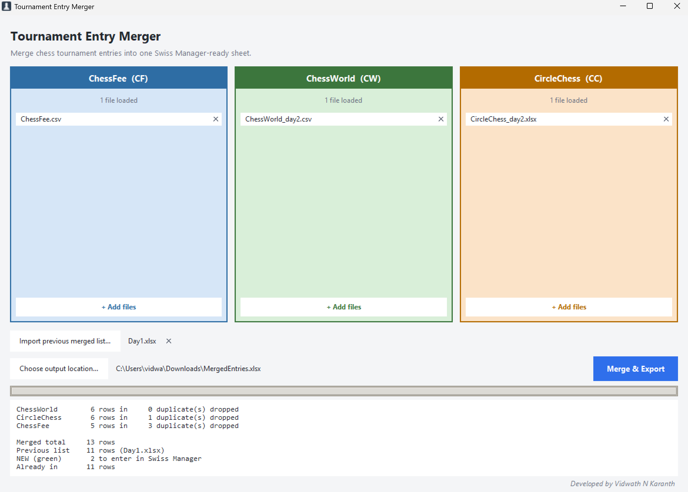

# Tournament Entry Merger

**Merge chess tournament entries from three registration platforms into one
Swiss Manager-ready sheet — de-duplicated, and with new entries flagged.**




---

## The problem it solves

Entries for one tournament arrive through several registration sites, each
exporting a different file with different column names. Before pairings can
start, an arbiter has to combine them by hand, spot the players who registered
on two sites, and retype everything into Swiss Manager.

Worse, entries keep arriving. Re-download the exports the next day and you get
the same 80 players back plus the handful who just joined — with no way to see
which is which.

This app does the combining, and remembers who you already entered.

## What it does

- **Three colour-coded drop zones**, one per platform, so a file is never
  mis-identified. Each accepts several files, in case a platform exports in
  batches.
- **One clean output sheet** — 15 fixed columns, in a consistent order, with
  the platform-specific clutter (father's name, address, institute, lichess ID,
  and so on) dropped.
- **Cross-platform de-duplication** on FIDE / AICF / KSCA ID, so a player who
  registered twice appears once.
- **A green `NEW` flag** on the players who were not in your previous merged
  list — the only ones you still need to type into Swiss Manager.
- **Wrong-box detection**, so a CircleChess export dropped into the ChessFee
  box is refused with a message naming the right box, instead of silently
  producing garbage.
- **Single `.exe`** — no Python, no installer, no admin rights on the machine
  that runs it.

---

## Download

The application is published on the
**[Releases](../../releases)** page — download
`TournamentEntryMerger.exe` and double-click it.

There is nothing to install: no Python, no setup wizard, no admin rights. It
runs on Windows 10 and 11 (64-bit).

Windows SmartScreen may warn about an unrecognised publisher the first time,
because the executable is not code-signed. Choose *More info → Run anyway*.

---

## Using it

1. **Drop each platform's export into its own coloured box** — blue for
   ChessFee, green for ChessWorld, orange for CircleChess. Use *+ Add files* if
   you would rather browse. Each file can be taken back out with its ✕.
2. **Import previous merged list** *(optional)* — the `.xlsx` this app produced
   last time. Skip it on the first merge of a tournament.
3. **Choose output location** — where to save the merged `.xlsx`.
4. **Merge & Export.** The panel at the bottom reports rows in per platform,
   duplicates dropped, how many are new, and the final row count.

### The daily routine

**Day 1 —** download the three exports, merge them with no previous list, save
as `Tournament_Day1.xlsx`. Every row is green `NEW`. Enter all of them into
Swiss Manager.

**Day 2 —** download the three exports again, drop them in, and this time
import `Tournament_Day1.xlsx` as the previous list. Save as
`Tournament_Day2.xlsx`. Filter the **Status** column to `NEW` — those are the
only players who joined since yesterday. Enter just those.

**Day 3 —** same again, using `Tournament_Day2.xlsx` as the previous list.

Each day's output is the complete entry list *and* the baseline for tomorrow.

---

## The output sheet

One sheet, `Entries`, with a frozen header row and an auto-filter.

| # | Column | Notes |
|---|---|---|
| 1 | **Platform** | `CF` / `CW` / `CC`, cell filled with the platform's colour |
| 2 | Student Name | |
| 3 | FIDE ID | |
| 4 | DOB | normalised to `DD-MM-YYYY` when recognisable |
| 5 | Gender | |
| 6 | Mobile Number | |
| 7 | Email Id | |
| 8 | AICF ID | |
| 9 | KSCA ID | |
| 10 | District | |
| 11 | State | |
| 12 | Category | |
| 13 | Entry Fee | written as a number, so it totals |
| 14 | **Payment Date** | `DD-MM-YYYY HH:MM` when the source has a time, blank when the platform never supplies one |
| 15 | **Status** | `NEW` on green, or `ALREADY ENTERED` on grey |

IDs, phone numbers, dates and the status are written as text, so Excel cannot
reinterpret a FIDE ID as a number or an Indian date as an American one.

### Rules applied

| Rule | Behaviour |
|---|---|
| Row order | Grouped by platform: all ChessWorld rows, then CircleChess, then ChessFee |
| Order within a group | Rows with a payment date first (earliest → latest), then the rest in their original input-file order — never re-sorted by name |
| Duplicates | Matched on FIDE / AICF / KSCA ID; the first row in the above order wins, so a ChessWorld entry beats a CircleChess one, and within ChessWorld the earliest payment survives |
| Placeholder IDs | `-`, `0`, `00`, `N/A`, `UNRATED`, `AICF ID not available` and similar are treated as blank before matching; blank never matches blank |
| Shared IDs | A matching ID does **not** collapse two rows whose dates of birth differ — parents register several children under one ID, and both children paid. Both rows are kept and the pair is listed in the summary |
| Date formats | `DD/MM` vs `MM/DD` is decided once per column from the whole column, not guessed per value — ChessWorld writes `M/D/YYYY`, ChessFee writes `DD/MM/YYYY` |
| Awkward `.xlsx` files | Portal exports whose styling openpyxl rejects are read with a fallback reader instead of failing |
| Status | `NEW` for players absent from the imported previous list; everyone is `NEW` when no list is imported |
| Players with no ID at all | Compared on name + DOB instead, so they are not flagged new every day |
| Registration status columns | Ignored — every row in the export is included |
| CircleChess workbooks | Only the `Participants` sheet is read; `NationalRatingList` is skipped |
| Unreadable previous list | The merge still completes, everyone is marked `NEW`, and the app says why |

---

## Supported platforms

The app never guesses which platform a file came from — the box it was dropped
into decides, and these headers are read from it:

| Output column | ChessFee `.csv` | ChessWorld `.csv` | CircleChess `.xlsx` (`Participants`) |
|---|---|---|---|
| Student Name | `NAME` | `Name` | `name` |
| FIDE ID | `FIDE_ID` | `FIDE ID` | `fide_id` |
| AICF ID | `aicfno` | `AICF ID` | `aicf_id` |
| KSCA ID | `tnscano` | `KSCA ID` | `state_id` |
| DOB | `DOB` | `DOB` | `dob` |
| Gender | `GENDER` | `Gender` | `gender` |
| Mobile Number | `MOBILE_NUMBER` | `Phone` | `mobile_number` |
| Email Id | `Email` | `Email` | `email` |
| District | `DISTRICT` | `District` | `district` |
| State | `STATE` | `State` | `state` |
| Category | `AGE_CATEGORY` | `Category` | `category` |
| Entry Fee | `amount` | `Amount Paid` | `amount` |
| Payment Date | *(none)* | `Date` | *(none)* |

---

## Configuration

Everything platform-specific lives in [`config/platforms.json`](config/platforms.json):

- **`platforms`** — each platform's display name, abbreviation, drop-zone and
  cell colours, worksheet name, and the source header for every column above.
  Adding a fourth registration site is a new entry here, not a code change.
- **`output_columns`** — the columns in the merged sheet, in order.
- **`output_platform_order`** — which platform's block comes first. Separate
  from the left-to-right order of the boxes in the window, so you can change
  one without disturbing the other.
- **`status`** — the `NEW` / `ALREADY ENTERED` labels and their fill colours.
- **`placeholder_ids`** — the values treated as "no ID".

The packaged app prefers a `config/platforms.json` sitting **next to the
`.exe`** over its own bundled copy, so a header can be corrected on site
without rebuilding.

---

## Command line

Useful for scripting or for checking a merge without opening the window:

```bash
python cli.py --chessworld ChessWorld.csv --circlechess CircleChess.xlsx --chessfee ChessFee.csv -o Merged.xlsx
```

| Flag | Purpose |
|---|---|
| `--chessfee` / `--chessworld` / `--circlechess` | input files (each accepts several) |
| `-o`, `--output` | the merged `.xlsx` to write |
| `-p`, `--previous` | a merged `.xlsx` from a previous run; only players missing from it are marked `NEW` |
| `--report` | list every dropped duplicate and which ID it matched on |

---

## Development

```bash
python -m venv .venv
.venv/Scripts/python.exe -m pip install -r requirements.txt
.venv/Scripts/python.exe samples/make_samples.py   # generate sample exports
.venv/Scripts/python.exe -m unittest discover -s tests
```

Build the executable:

```bash
.venv/Scripts/python.exe -m PyInstaller build.spec --noconfirm
```

Check a build on a machine without a screen — writes a diagnostics file and
exits instead of opening the window:

```bash
TEM_SELFTEST=selftest.txt dist/TournamentEntryMerger.exe
```

Redraw the app icon after editing its shape or colours:

```bash
.venv/Scripts/python.exe assets/make_icon.py
```

### Project structure

| Path | Purpose |
|---|---|
| `main.py` | entry point, plus the `TEM_SELFTEST` diagnostics hook |
| `gui.py` | the three drop zones, previous-list button, progress and summary |
| `cli.py` | command-line front end |
| `pipeline/loader.py` | reads a file using its platform's conventions |
| `pipeline/normalize.py` | column mapping, ID and date cleanup, wrong-box detection |
| `pipeline/dedupe.py` | ordering and duplicate collapsing |
| `pipeline/baseline.py` | comparison against the previous merged list |
| `pipeline/writer.py` | the 15-column `.xlsx` and its colour fills |
| `pipeline/merger.py` | ties the stages together and collects per-file reports |
| `config/platforms.json` | all platform-specific configuration |
| `assets/make_icon.py` | draws the chess-pawn app icon |
| `samples/make_samples.py` | generates stand-in exports for testing |
| `tests/` | unit tests for mapping, ordering, de-duplication and status |

### Built with

Python 3.11+ · pandas · openpyxl (with python-calamine as a fallback reader)
· tkinter with tkinterdnd2 · PyInstaller. Pillow is used only to draw the
icon, never at runtime.

---

## Troubleshooting

**"…looks like a CircleChess export, not a ChessFee one."**
The file went into the wrong box. The message names the right one.

**"…has no 'Participants' sheet."**
CircleChess workbooks must contain that sheet; only it is read.

**"Could not write … it may be open in Excel."**
Close the output file and merge again.

**A column comes out blank for every row.**
That platform changed a header name. Correct it in
`config/platforms.json` — the run also prints which columns it could not find.

**Someone is marked `NEW` who was already entered.**
They have no usable ID on either side, and their name or DOB differs between
the two exports. Enter them once and correct the spelling at the source.

**"N pair(s) kept — same ID, different DOB" in the summary.**
Two players are registered under one ID, usually siblings entered by a parent.
Both are kept, because both paid. Worth correcting at the registration portal.

---

## Credits

Developed by **Vidwath N Karanth**.

## Licence

Copyright © 2026 Vidwath N Karanth. All rights reserved.

**Free to use** — arbiters and organizers may download and use the application
for their tournaments at no cost.

**Not free to copy** — the source code and the application may not be
redistributed, modified, sold, or reused without written permission.

Permission for anything beyond personal use — a school, academy, club or
federation deployment, adapting it for other registration platforms, or any
commercial use — is welcomed and considered case by case. Open an
[issue](../../issues) to ask.

See [LICENSE](LICENSE) for the full terms.
